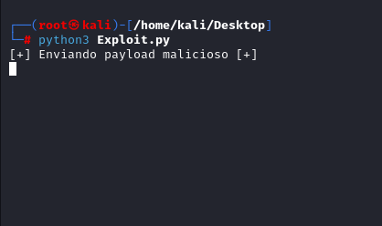
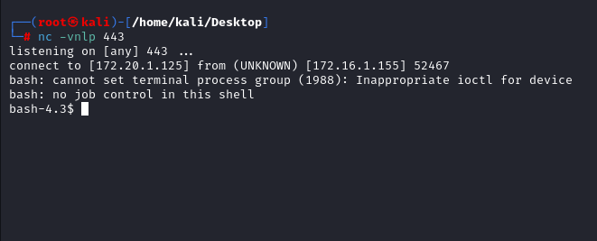

# IPFire-2.19-x86_64---Core-Update-109-Blind-RCE
Um Script python para uma falha de Blind RCE

O Script foi baseado ao seguinte exploit: https://www.exploit-db.com/exploits/42149
Onde é explorado uma falha no Firwall IPFire versão 2.19 x86_64 Core Update 110, mas que também funciona na versão Core Update 109

No script utilizado pelo exploit existe uma verificação se existe ou não a vulnerabilidade a ser explorada, mas como a verificação é baseada em uma resposta traz como resultado que o serviço não é vulneravel e encerra a execução do script.
Mas após poucas modificações é possível retirar essa verificação e executar o script.

Utilização:

Executando o script:

	

Recebendo a shell:

	

Obs: Imagens tiradas utilizando um host para fins de estudo
